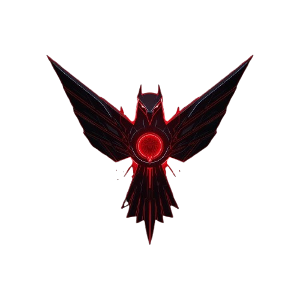

<div align="center">



# RedForge

### Autonomous Security Orchestration Engine

**Real HTTP vulnerability assessment. Parallel execution. AI-powered remediation.**

[](https://redforgex.vercel.app)
[](#orchestration-engine)
[](#modules)
[](LICENSE)

</div>

---

## What is RedForge?

RedForge is an autonomous security orchestration platform that runs **real HTTP probes** against target URLs — not simulations. It coordinates 11 detection modules in parallel, correlates findings into multi-stage attack chains, and generates ready-to-paste remediation code for every vulnerability it finds.

> ⚠️ **Ethical use only.** Only scan systems you own or have explicit written permission to test.

---

## Orchestration Engine

The engine (`scanner/index.ts`) operates in **6 sequential phases**, with the core detection running fully in parallel:

```
Phase 1 ── Target fingerprinting (tech stack, HTTP status, headers)
Phase 2 ── Parallel module execution (11 modules fire simultaneously)
Phase 3 ── Active probing, SQLi injection, rate-limit tests [ACTIVE mode]
Phase 4 ── AI deep analysis via NVIDIA NIM (Nemotron-70b)
Phase 5 ── Attack chain correlation (7 multi-stage exploit patterns)
Phase 6 ── Deduplication, risk scoring, enrichment, scan diff
```

### Parallel Execution

All 11 modules run via `Promise.all` — no sequential bottleneck:

```
┌─────────────────────────────────────────────────────────┐
│  TLS/Cookies  │  Headers  │  Info Disclosure  │  Auth   │
│  Supply Chain │    XSS    │  SSRF/Redirect    │  DNS    │
│  API Security │ WordPress │    ← 11 modules   │         │
└─────────────────────────────────────────────────────────┘
          ↓ all findings merged & deduplicated
      Attack Chain Correlation Engine
          ↓
      Enrichment Pass (remediation + CVE + compliance + diff)
```

### Attack Chain Correlation

RedForge doesn't just list individual findings — it identifies **multi-stage exploit chains** by correlating finding tags:

| Chain | Tags Required | Severity |
|-------|--------------|----------|
| XSS + Session Hijack | `xss` + `httponly` | CRITICAL |
| SSRF + Cloud Metadata | `ssrf` + `aws/gcp` | CRITICAL |
| WordPress + RCE | `xmlrpc` + `wp` | HIGH |
| Credential Stuffing | `rate-limit` + `auth` | HIGH |
| Supply Chain Injection | `sri` + `xss` | HIGH |

---

## Modules

| # | Module | What it detects |
|---|--------|----------------|
| 1 | **TLS/Cookies** | HSTS, secure/HttpOnly flags, weak cipher suites |
| 2 | **Headers** | CSP, X-Frame, Referrer-Policy, Permissions-Policy |
| 3 | **Info Disclosure** | Server version banners, stack traces, debug logs |
| 4 | **Auth Security** | Login panel exposure, default credentials, JWT issues |
| 5 | **Supply Chain** | Missing SRI on CDN scripts, dependency confusion |
| 6 | **XSS Detection** | Reflected, DOM-based, stored XSS patterns |
| 7 | **SSRF/Redirect** | Open redirects, meta-refresh, SSRF parameter probing |
| 8 | **DNS Security** | SPF, DMARC, DKIM, CAA record validation |
| 9 | **API Security** | GraphQL introspection, WAF fingerprinting, directory traversal |
| 10 | **WordPress** | Version disclosure, XML-RPC, user enum, plugin discovery |
| 11 | **AI Analysis** | NVIDIA Nemotron-70b deep pattern analysis |

---

## Enrichment Pipeline

After detection, every finding is automatically enriched:

- **Auto-Remediation** — 20 fix templates (nginx / apache / express / DNS) attached as ready-to-paste code
- **CVE Enrichment** — NVD API v2 lookup for detected software versions with CVSS scores
- **Compliance Mapping** — GDPR articles, PCI DSS, ISO 27001, NIST SP800-53, **DPDP Act 2023** (India)
- **Scan Diffing** — new/resolved/regressed findings vs previous scan, with real fix rate %

---

## Stack

| Layer | Tech |
|-------|------|
| Frontend | React 18 + Vite + Tailwind CSS v4 |
| Backend | Express 5 + Node.js |
| Database | PostgreSQL + Drizzle ORM |
| AI | NVIDIA NIM — `nvidia/llama-3.1-nemotron-70b-instruct` |
| Deployment | Vercel (static CDN + serverless function) |
| Monorepo | pnpm workspaces |

---

## Quick Start

```bash
# Install
pnpm install

# Push DB schema
pnpm --filter @workspace/db run push

# Seed demo data
pnpm --filter @workspace/scripts run seed

# Run (both servers)
pnpm run dev
```

**Required env vars:**

```env
DATABASE_URL=postgresql://...
SESSION_SECRET=your-random-secret
NVIDIA_NIM_API_KEY=nvapi-...       # enables AI analysis (Nemotron-70b)
APP_URL=https://redforgex.vercel.app
```

---

## Scan Modes

| Mode | What runs |
|------|-----------|
| **PASSIVE** | All 11 parallel modules + correlation engine |
| **ACTIVE** | + SQLi probes, rate-limit tests, business logic checks |

---

## License

MIT — for educational and portfolio purposes. Scan only systems you own or have permission to test.
